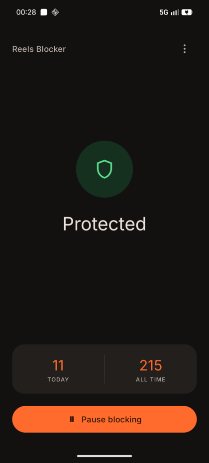
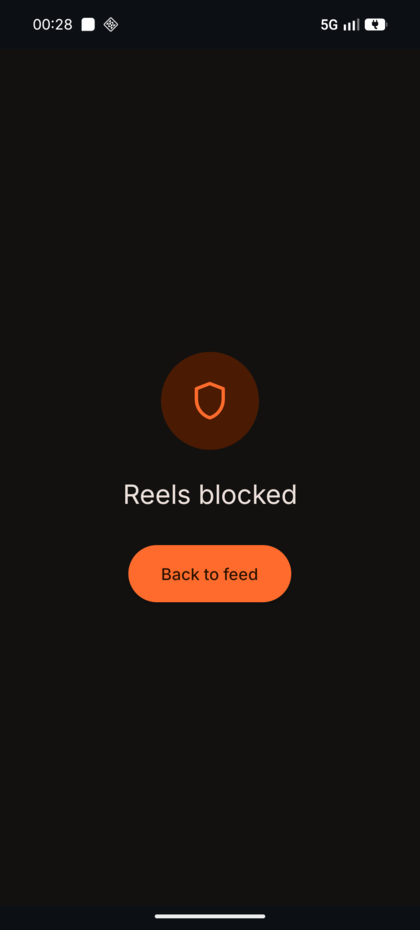
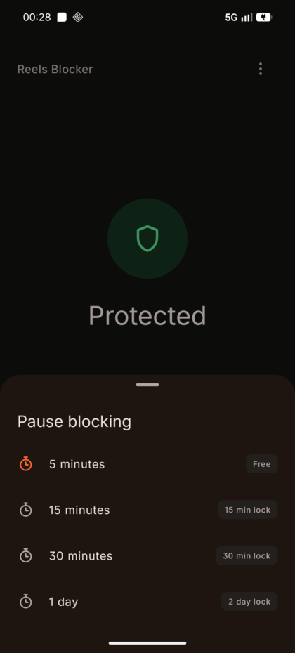

# Reels Blocker

**Blocks Instagram Reels. Leaves the rest of Instagram alone.**

An Android app for people who open Instagram to check one thing and resurface forty minutes later.

  
  
  

## What it does

Open Instagram and everything works: posts, stories, DMs, search, your profile. Tap the Reels tab, or a reel from Explore, and a screen covers it instead. There's one button on that screen, Back to feed, and it puts you back where you were.

Nothing to configure, no daily timer to set. It's on until you turn it off.

The home screen counts the reels you didn't end up watching, today and all time.

## What still plays

Blocking the wrong thing is worse than blocking nothing, so two reels get through.

A reel someone sends you in a DM plays, because a person chose that one for you. So does a reel you tap in your own feed, since you scrolled past it and decided you wanted it.

You get that reel and no more. Swipe up to the next one and the block screen is back, because that swipe is where watching a reel turns into losing an hour. If you want another, back out and tap it. Mildly annoying on purpose.

## Taking a break

Day to day there's no off switch, only Pause blocking, which asks how long:

| Pause | What it costs |
|---|---|
| 5 minutes | Free |
| 15 minutes | 15 min lock afterwards |
| 30 minutes | 30 min lock afterwards |
| 1 day | 2 day lock afterwards |

The lock is what stops a long pause being taken again the second it ends. While one is running you can't pause at all, and the five-minute option is locked with the rest, so a day off doesn't quietly become a day off plus five minutes every five minutes.

Free means the five minutes charges no lock of its own. Take it on its own and you can take it again straight away.

Change your mind and you can resume early, from the app or from the notification, and you're only charged for the time you actually used. Drop a day-long pause after 3 hours and it costs 6 hours instead of 2 days.

Pauses survive restarts and reboots, and they end on their own.

## Turning it off for good

You can. An app you can't quit isn't a helper.

Getting there is deliberately awkward. Seven taps on the shield, which cracks a little more each time, then five confirmations, one of which makes you type out a sentence about what you're doing. Turning it back on takes a single tap and asks you nothing.

## Install

Grab `app-release.apk` from the [latest release](https://github.com/vsniranjan/reels-blocker/releases/latest) and sideload it. Then on the phone:

1. Open Reels Blocker once, so it can notify you if blocking ever stops working.
2. Settings → Accessibility → Reels Blocker → enable.
3. If that toggle is greyed out, it's Android being wary of sideloaded apps. Go to App info for Reels Blocker → ⋮ → Allow restricted settings, then try step 2 again.

That's it. Open Instagram and try a reel.

## If reels stop being blocked

Instagram renames things inside its own app a few times a year, which is enough to break detection. The app watches for that and notifies you if it hasn't seen a reel in four days.

Fixing it means a computer and a rebuild. The [technical notes](docs/technical.md) have the steps.

## Good to know

It only ever looks at Instagram. The one permission it asks for is the one that lets it send you notifications, and there's no internet permission in the manifest at all, so nothing it sees can leave your phone.

Not affiliated with Instagram or Meta. Personal project, use at your own risk.

---

Build instructions and how the detection actually works: [technical notes](docs/technical.md). Licensed [MIT](LICENSE).
